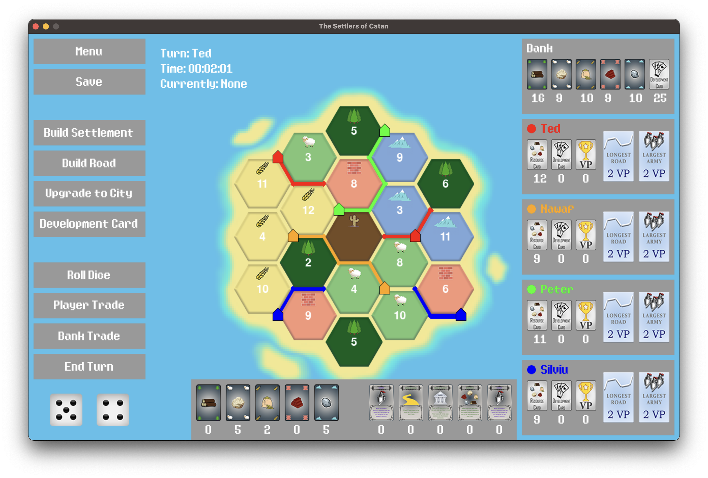

# The Settlers of Catan

> A game inspired by Catan, written in Python using PyGame.



## Introduction

The Settlers of Catan is an attempt at a clone of the game [Catan](https://www.catan.com/) (also known as "The Settlers"), with some small changes in places. It was created as a [group](#the-team) project for a Software Engineering assignment in our second year of University.

## Table of Contents

- [Introduction](#introduction)
- [Key features](#key-features)
- [Requirements](#requirements)
- [Setup](#setup)
- [Development Team](#development-team)
- [Contributing](#contributing)

## Key Features

- [x] Singleplayer against AI or multiplayer (local/hot-seat).
- [ ] Games can be saved and resumed using JSON a save-file.

## Requirements

Project was created with:

- Python version: `3.11.0`
- Pygame version: `2.1.3.dev8`
- Pip version: `23.0`

Setup also assumes access to git CLI.

## Setup

Setup instructions should apply to all platforms (Windows, Linux, and macOS). However, do note:

1. Make sure you have the [required](#requirements) version of Python installed, and the git CLI.

2. Clone the repository.

    ```
    git clone https://github.com/TedAlden/settlers-of-catan
    cd settlers-of-catan
    ```

3. Install the required Python packages using `pip`.

    ```
    python3 -m pip install -r requirements.txt
    ```

4. Run the game using `python3`.

    ```
    python3 main.py
    ```

> **Note**
> - Some systems may have Python 3 installed as `python3` or `python`, so adjust installation steps as necessary.
> - Debian-based distributions of Linux may not have `pip` pre-installed. In this case, install it using `sudo apt install python3-pip`.

## Development Team

Our team consisted of six people, of which some worked on the development of the software itself and others worked on documentation and other aspects of the project.

- Ted - [@TedAlden](https://github.com/TedAlden)
- Peter - [@PeterJames1996](https://github.com/PeterJames1996)
- Nawaf - [@NawafQ55](https://github.com/NawafQ55)
- Lyes - [@ls2009](https://github.com/ls2009)
- Aiden - [@AidenGeraghty](https://github.com/AidenGeraghty)
- Silviu

## Contributing

Not currently accepting contributions as it is a University assignment, but will be open after submission on 28th April 2023.
